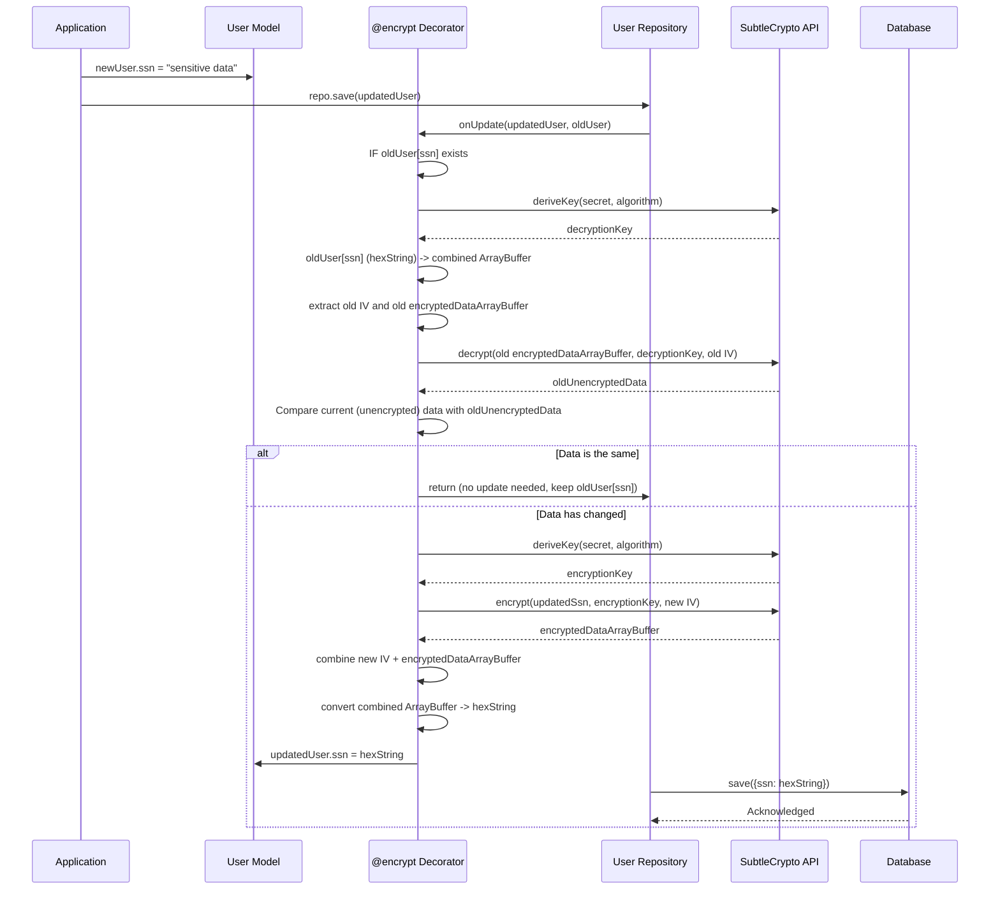
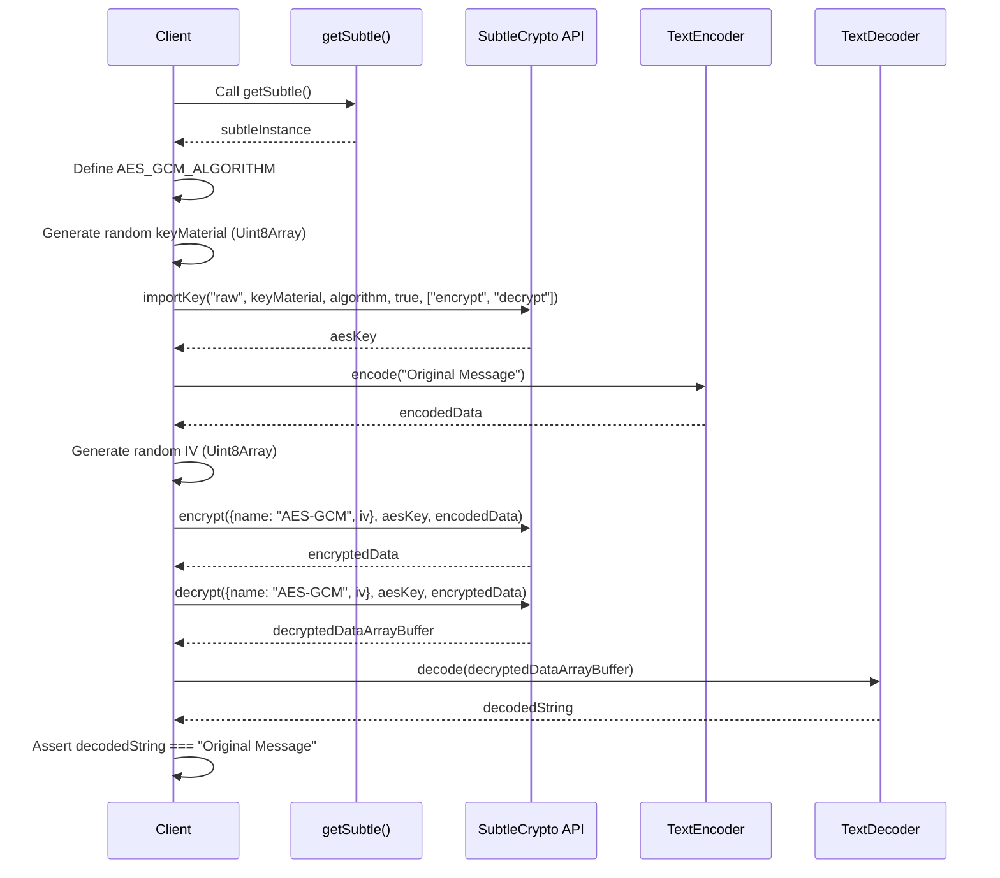
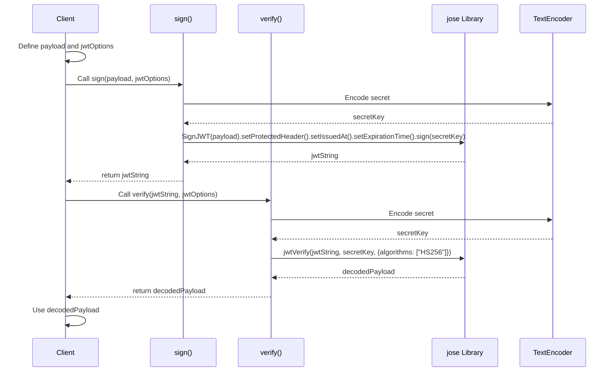

# @decaf-ts/crypto

## Secure Cryptographic Utilities for decaf-ts

The `@decaf-ts/crypto` module offers a comprehensive suite of cryptographic utilities designed to integrate seamlessly within the decaf-ts ecosystem. Providing a unified `SubtleCrypto` interface for both browser and Node.js environments, this library simplifies secure data handling. It features a powerful `@encrypt` decorator for automatic encryption and decryption of model properties during database operations, alongside robust tools for JSON Web Token (JWT) signing and verification. Whether you're securing sensitive model data or managing authentication tokens, `@decaf-ts/crypto` delivers essential cryptographic functionalities with ease of use and environmental adaptability.


[](https://github.com/decaf-ts/ts-workspace/actions/workflows/nodejs-build-prod.yaml)
[](https://github.com/decaf-ts/ts-workspace/actions/workflows/codeql-analysis.yml)[](https://github.com/decaf-ts/ts-workspace/actions/workflows/snyk-analysis.yaml)
[](https://github.com/decaf-ts/ts-workspace/actions/workflows/pages.yaml)
[](https://github.com/decaf-ts/ts-workspace/actions/workflows/release-on-tag.yaml)


Documentation [here](https://decaf-ts.github.io/crypto/), Test results [here](https://decaf-ts.github.io/crypto/workdocs/reports/html/test-report.html) and Coverage [here](https://decaf-ts.github.io/crypto/workdocs/reports/coverage/lcov-report/index.html)


### Description

simple wrappers around Crypto and SubtleCrypto (browser resilient).

and optional integration with the @decaf-ts framework


# How to Use @decaf-ts/crypto

This document provides practical examples for utilizing the `@decaf-ts/crypto` library.

## 1. Using the `@encrypt` Decorator for Model Encryption

The `@encrypt` decorator simplifies the process of securing sensitive data in your `decaf-ts` models by automatically encrypting property values before saving and decrypting them upon retrieval. The encrypted data, along with its Initialization Vector (IV), is stored as a single hexadecimal string in the database.

### Use Case: Encrypting a User's SSN in a Database Model

Let's assume you have a `User` model and you want to encrypt the `ssn` property.

#### TypeScript Example

```typescript
import { Model, prop } from '@decaf-ts/decorator-validation';
import { encrypt } from '@decaf-ts/crypto/integration'; // Import the encrypt decorator

// Define the algorithm for encryption
const AES_GCM_ALGORITHM = { name: "AES-GCM", length: 256 };

@Model()
class User {
  @prop()
  id: string;

  @prop()
  name: string;

  @prop()
  @encrypt("mySuperSecretKey12345678901234567890", AES_GCM_ALGORITHM) // Encrypt the ssn field
  ssn: string; // This field will be encrypted in the database as a hex string
}

// Example usage (assuming a Repo context)
async function demonstrateEncryption() {
  // Imagine 'userRepo' is an instance of your decaf-ts repository for User model
  const userRepo: any = {}; // Placeholder for actual Repo instance

  const newUser = new User();
  newUser.id = "user123";
  newUser.name = "John Doe";
  newUser.ssn = "123-45-678"; // This will be encrypted automatically on 'create' or 'update'

  // On create (ssn is encrypted before saving)
  // await userRepo.create(newUser);
  // In the database, newUser.ssn would look something like: "a1b2c3d4e5f67890..." (a hex string)

  // On read (ssn is decrypted automatically after retrieval)
  // const fetchedUser = await userRepo.findById("user123");
  // console.log(fetchedUser.ssn); // Will output "123-45-678"
}
```

#### Sequence Diagram: Encryption/Decryption Flow with `@encrypt`



## 2. Basic `SubtleCrypto` Encryption and Decryption

Directly using `SubtleCrypto` for low-level cryptographic operations. This demonstrates a secure AES-GCM encryption flow.

### Use Case: Encrypting and Decrypting a Message

#### TypeScript Example

```typescript
import { getSubtle } from '@decaf-ts/crypto/common/crypto'; // Assuming this path
import { CryptoKey } from '@decaf-ts/crypto/common'; // Assuming CryptoKey is exported here

async function basicSubtleCryptoExample() {
  const subtle = await getSubtle();

  // 1. Define the algorithm and generate a key
  const algorithm = { name: "AES-GCM", length: 256 };
  const keyMaterial = crypto.getRandomValues(new Uint8Array(32)); // 32 bytes for AES-256
  const aesKey: CryptoKey = await subtle.importKey(
    "raw",
    keyMaterial,
    algorithm,
    true, // extractable
    ["encrypt", "decrypt"]
  );

  // 2. Data to encrypt
  const originalData = "Hello, secure world!";
  const encodedData = new TextEncoder().encode(originalData);

  // 3. Generate a random Initialization Vector (IV) for AES-GCM
  const iv = crypto.getRandomValues(new Uint8Array(12)); // 96-bit IV is recommended for AES-GCM

  // 4. Encrypt the data
  const encryptedData = await subtle.encrypt(
    { name: algorithm.name, iv: iv },
    aesKey,
    encodedData
  );
  console.log("Encrypted Data ArrayBuffer:", encryptedData);

  // 5. Decrypt the data
  const decryptedData = await subtle.decrypt(
    { name: algorithm.name, iv: iv },
    aesKey,
    encryptedData
  );

  // 6. Decode and verify
  const decodedData = new TextDecoder().decode(decryptedData);
  console.log("Decrypted Data:", decodedData);
  console.assert(decodedData === originalData, "Decryption failed!");
}

basicSubtleCryptoExample();
```

#### Sequence Diagram: Basic Encryption/Decryption



## 3. JWT Signing and Verification

Utilizing the provided utilities to create and validate JSON Web Tokens.

### Use Case: Creating and Verifying an Authentication Token

#### TypeScript Example

```typescript
import { sign, verify } from '@decaf-ts/crypto/jwt';

async function jwtExample() {
  const secret = "your-very-strong-jwt-secret-here-at-least-32-chars"; // Must be strong and kept secret
  const payload = {
    userId: "user123",
    role: "admin",
    data: { organization: "decaf-ts" }
  };
  const jwtOptions = { secret: secret, expiry: "1h" };

  // 1. Sign the JWT
  const token = await sign(payload, jwtOptions);
  console.log("Generated JWT:", token);

  // 2. Verify the JWT
  try {
    const decodedPayload = await verify(token, jwtOptions);
    console.log("Verified Payload:", decodedPayload);
    console.assert(decodedPayload.userId === payload.userId, "User ID mismatch!");
  } catch (error) {
    console.error("JWT Verification Failed:", error);
  }

  // Example of a tampered token (will fail verification)
  const tamperedToken = token + "x";
  try {
    await verify(tamperedToken, jwtOptions);
    console.error("Verification should have failed for tampered token!");
  } catch (error) {
    console.log("Tampered token verification failed as expected.");
  }
}

jwtExample();
```

#### Sequence Diagram: JWT Signing and Verification



### Related

[](https://github.com/decaf-ts/ts-workspace)

### Social

[](https://www.linkedin.com/in/TiagoVenceslau/)


#### Languages


## Getting help

If you have bug reports, questions or suggestions, please [create a new issue](https://github.com/decaf-ts/ts-workspace/issues/new/choose).

## Contributing

I am grateful for any contributions made to this project. Please read [this](./workdocs/98-Contributing.md) to get started.

## Supporting

The first and easiest way you can support it is by [Contributing](./workdocs/tutorials/Contributing.md). Even just finding a typo in the documentation is important.

Financial support is always welcome and helps keep both me and the project alive and healthy.

So if you can, if this project in any way. either by learning something or simply by helping you save precious time, please consider donating.

## License

This project is released under the [MIT License](./LICENSE.md).

By developers, for developers...