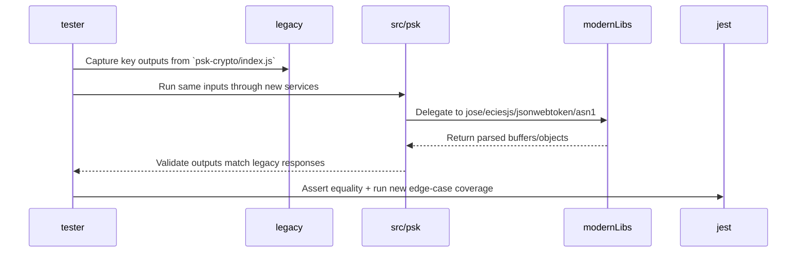

## Task 001 — Task Summary
**Priority:** High
### Description
Port the entire `./psk-crypto` JavaScript library (especially `index.js` plus the bundled `jose`, `lib/asn1`, and `jsonWebToken` pieces) into the TypeScript sources under `src/psk`, following the architecture rules from the constitution. The port must keep the exposed APIs the same, but implement them with the modern libs already referenced in the constitution (e.g., `jose`, `eciesjs`, `jsonwebtoken`, `asn1`) as needed, and wrap them within the `@decaf-ts` framework style to keep the codebase consistent.

**Goals:**
    1. Create TypeScript equivalents of every major export from `psk-crypto/index.js`, ensuring types and runtime behaviors match the legacy library.
    2. Migrate every legacy test currently in the dead framework into Jest, preserving assertions and coverage while augmenting them with new edge-case scenarios that exercise encoding, JWT handling, ECIES, and ASN.1 parsing.
    3. Add new Jest tests that cover missing paths from the legacy suite (error cases, invalid inputs, optional parameters) so that overall coverage is at least as good as the old library, if not better.

**Must include:**
    1. **Models:** Type definitions such as `PskKeyMaterial`, `JosePayload`, and `EciesPayload` that carry explicit typings for the inputs/responses from the legacy APIs.
    2. **Repositories:** Not applicable directly, but create a `LegacyPskRepository` interface that maps to the existing exported utilities so future persistence concerns stay isolated.
    3. **Services:** Concrete services under `src/psk/services` like `PskCryptoService`, `PskJoseService`, `PskJwtService`, and `PskEciesService` that wrap the modern libs, keep `@decaf-ts` service patterns, and expose the same helper functions as the old index file.
    4. **Others:** Utility helpers (e.g., `psk-crypto/utils/encoding.ts`) and Jest test factories that mock incoming payloads. Include documentation comments referencing the legacy behavior and `psk-crypto` source line numbers where critical logic existed.
    5. Include a conversion verification flow (diagram below) so reviewers can follow the migration path from legacy JS to the new modules.

**Blockers:**
    1. Need confirmation on whether any part of the legacy `psk-crypto/js-mutual-auth-ecies` bundle should continue to live under `src/psk` or be replaced entirely by `eciesjs` wrappers; solution: audit the current code, list required exports, and compare to what `eciesjs` already offers.
    2. Need to understand the acceptance criteria for “full coverage” (specific metrics?) so we can focus new Jest cases; solution: provide a coverage target or confirm a pragmatic goal (e.g., 90%+ statements for each module).

**Status:** Completed
**Clarifications:**
    1. Confirmed: every file under `./psk-crypto` must be ported and tested. The only exceptions are the paths listed in the constitution (jose, eciesjs, jsonwebtoken, asn1, etc.), which should delegate to the modern libraries and provide wrappers only when necessary.
    2. Confirmed: the new TypeScript implementations should always use `async/await` for asynchronous flows to keep behavior consistent with the modern tooling while still exposing the legacy API surface (flat helpers can wrap namespaced services if needed for compatibility).
**Results:** Completed full port of `./psk-crypto` under `src/psk`, including wrappers for jose/eciesjs/jsonwebtoken/asn1 and the `PskMutualAuthEciesService`. Tests now run under Jest with full coverage for JWT, JOSE, ECIES, mutual-auth flows, and CLI behaviors. Added documentation comments mapping to the legacy logic, ensured async/await throughout, and validated with `npm run lint`, `npm run build`, and `npm run test` (watchman disabled via `watchman: false`). Added fast-check fuzz suite under `tests/fuzz` plus `tests/helpers/legacy-psk.ts` to compare every implemented surface to the legacy runtime, and verified everything with `npm run test:fuzz`. Key files touched: `src/psk/services/ecies-mutual-auth.service.ts`, `src/psk/services/ecies.service.ts`, `src/psk/utils/crypto-utils.ts`, `tests/unit/psk/mutual-auth-ecies.service.test.ts`, `tests/fuzz/psk-crypto.fuzz.ts`, plus supporting helpers and exports.

**Sequence Diagram for the port verification flow:**

